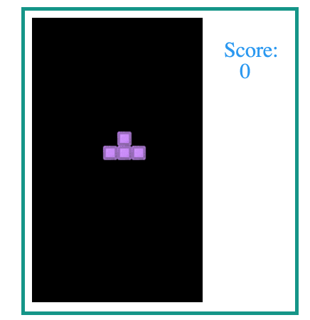

## Tetris JD

This is an example how create tetris just with native JavaScript.


ScreenShot:


///////////////////////////////////////////////////////////////

Requirement:

- node


///////////////////////////////////////////////////////////////

Open 1 terminal:

- Install all dependencies: ```npm install```

- Run the Webpack Dev Server with the command line : npm run dev

- Go to http://localhost:8080


///////////////////////////////////////////////////////////////

